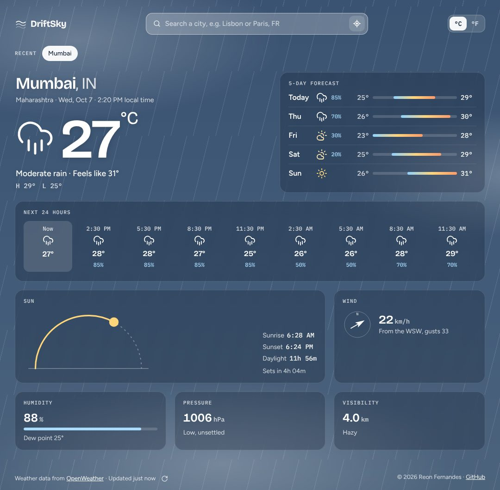

# DriftSky

DriftSky is a weather app built with React and the [OpenWeather API](https://openweathermap.org/api).
Search for any city to see the weather there right now, the next 24 hours and the next 5 days.
The whole screen becomes the sky over that city: its colour follows the local time of day and the current conditions.



## Features

- **Live sky background** for dawn, day, dusk and night, tinted for cloud, rain, storms, snow and fog
- **Current conditions** with "feels like", today's high and low, and the city's local time
- **Next 24 hours** in 3-hour steps and a **5-day forecast**, both with chance of rain
- **Details:** sun path with sunrise and sunset, wind direction and gusts, humidity with dew point, pressure and visibility
- **Search with suggestions** as you type, including `City, CC` (for example `Paris, FR`)
- **Use my location**, a **°C/°F toggle**, and **recent cities**; the last city reopens on your next visit
- Clear messages for a missing or invalid API key, an unknown city, rate limits and being offline
- Works on phones and desktops, supports keyboard navigation and screen readers, and switches off animations when you prefer reduced motion

## Getting started

You need [Node.js](https://nodejs.org/) 18.18 or newer and a free OpenWeather API key.

1. Create a key at [home.openweathermap.org/api_keys](https://home.openweathermap.org/api_keys). New keys can take up to 2 hours to start working.
2. Install dependencies and add your key:

   ```bash
   npm install
   cp .env.example .env
   # then open .env and paste your key after VITE_WEATHER_API_KEY=
   ```

   In the Windows Command Prompt, use `copy .env.example .env` instead of `cp`.

3. Start the app:

   ```bash
   npm run dev
   ```

   Open the address Vite prints, usually http://localhost:5173.

## Scripts

| Command           | What it does                                   |
| ----------------- | ---------------------------------------------- |
| `npm run dev`     | Starts the development server                  |
| `npm run build`   | Builds the production version into `dist/`     |
| `npm run preview` | Serves the production build locally            |
| `npm run lint`    | Checks the code with ESLint                    |
| `npm test`        | Runs the unit tests with Vitest                |

## Project structure

```
src/
├── api/openWeather.js     OpenWeather requests and error types
├── lib/                   Pure helpers: data shaping, formatting, units (with tests)
├── hooks/                 useWeather, place suggestions, saved settings, live clock
├── components/            UI components
└── styles/                Design tokens, layout, sky and component styles
```

## How it uses the API

DriftSky calls three endpoints on OpenWeather's free plan:

- [Geocoding](https://openweathermap.org/api/geocoding-api) to turn a city name into coordinates
- [Current weather](https://openweathermap.org/current)
- [5-day / 3-hour forecast](https://openweathermap.org/forecast5)

Results are cached for 10 minutes per location. The API key is read from `VITE_WEATHER_API_KEY` and is included in the browser bundle,
as with any front-end-only app, so use a free key with no billing attached.

## Built with

- [React](https://react.dev/) 19 and [Vite](https://vite.dev/)
- [OpenWeather](https://openweathermap.org/) for weather data
- Plain CSS with design tokens, no UI framework

Made by [Reon Fernandes](https://github.com/reonfernandes).
